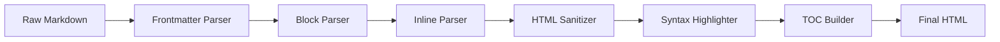

# MD Reader — Full Feature Demo

Welcome to **MD Reader** — a zero-dependency markdown renderer built from scratch using pure HTML, CSS, and JavaScript. No CDN, no npm, no build step.

---

## Text Formatting

This paragraph demonstrates **bold text**, _italic text_, **_bold and italic_**, ~~strikethrough~~, ==highlighted text==, and `inline code`. You can also use **bold with underscores** and _italic with underscores_.

Superscript: E = mc^2^. Subscript: Chemical formula H~2~O.

Keyboard shortcuts: <kbd>Ctrl</kbd>+<kbd>S</kbd> to save, <kbd>Ctrl</kbd>+<kbd>F</kbd> to search, <kbd>Cmd</kbd>+<kbd>Z</kbd> to undo.

Auto-linked URL: <https://example.com>

Auto-linked email: <user@example.com>

Link with title: [Visit Example](https://example.com "Go to example.com")

Hard line break by ending line with two spaces or backslash:  
This is on a new line.

---

## Emoji Shortcodes

:rocket: Launch · :fire: Hot · :star: Favorite · :heart: Love · :thumbsup: Approve · :warning: Alert · :bulb: Idea · :check: Done · :x: Error · :100: Perfect · :tada: Celebrate · :coffee: Break · :bug: Debug · :wrench: Fix · :books: Docs · :globe_with_meridians: Web · :computer: Code · :key: Auth · :lock: Secure · :zap: Fast

---

## Headings

# H1 — Main Title

## H2 — Section

### H3 — Subsection

#### H4 — Sub-subsection

##### H5 — Deep section

###### H6 — Deepest level

---

## Lists

### Unordered List

- First item at root level
- Second item with children
  - Nested child A
  - Nested child B
    - Deeply nested item
    - Another deep item
  - Nested child C
- Third root item
- Fourth root item

### Ordered List

1. Install dependencies
2. Configure the project
   1. Edit the config file
   2. Set environment variables
      1. DATABASE_URL
      2. API_KEY
3. Run the build
4. Deploy to production

### Task List

- [x] Design folder and file structure
- [x] Write the block-level parser
- [x] Write the inline parser
- [x] Add syntax highlighting for 6+ languages
- [x] Build table of contents with scroll-spy
- [x] Implement dark / light theme toggle
- [x] Add Ctrl+F in-page search
- [x] Support drag-and-drop file loading
- [ ] Add Mermaid diagram rendering
- [ ] Add print / export to PDF

### Mixed list with nesting

1. Frontend
   - HTML
   - CSS
     - [x] Tokens
     - [x] Theme
     - [x] Layout
   - JavaScript
2. Backend
   - Node.js
   - Python

---

## Blockquotes

> This is a simple blockquote. It can span multiple lines and contain **bold**, _italic_, and `code`.

> Multi-paragraph blockquote.
>
> Second paragraph inside the same blockquote, still styled correctly.

> Outer blockquote.
>
> > Inner nested blockquote — deeply nested quotes render correctly too.
> >
> > > Triple nested.

---

## Admonitions (GitHub-style Callouts)

> [!NOTE]
> This is a **Note** callout. Use it for supplemental information the reader should be aware of.

> [!TIP]
> This is a **Tip** callout. Great for sharing helpful suggestions and best practices.

> [!WARNING]
> This is a **Warning** callout. Use it to flag content that requires the reader's attention.

> [!DANGER]
> This is a **Danger** callout. Something could break or cause data loss if the user proceeds.

> [!IMPORTANT]
> This is an **Important** callout. Critical information necessary for the user to succeed.

---

## Code Blocks

### JavaScript / TypeScript

```javascript
import { readFile, writeFile } from "fs/promises";
import path from "path";

const SUPPORTED_LANGS = [
  "js",
  "ts",
  "jsx",
  "tsx",
  "python",
  "bash",
  "json",
  "html",
  "css",
];

async function processMarkdown(inputPath) {
  const raw = await readFile(inputPath, "utf-8");
  const { html, meta } = parse(raw);

  const outputPath = path.join(
    path.dirname(inputPath),
    `${path.basename(inputPath, ".md")}.html`,
  );

  await writeFile(outputPath, wrapHtml(html, meta));
  console.log(`✅ Written to ${outputPath}`);
  return outputPath;
}

class Parser {
  #extensions = new Map();

  constructor(options = {}) {
    this.options = { sanitize: true, highlight: true, ...options };
  }

  use(name, fn) {
    this.#extensions.set(name, fn);
    return this;
  }

  parse(text) {
    let result = text;
    for (const [, ext] of this.#extensions) {
      result = ext(result);
    }
    return result;
  }
}

const parser = new Parser({ sanitize: true });
const output = await processMarkdown("./README.md");
```

### Python

````python
from __future__ import annotations
from dataclasses import dataclass, field
from typing import Optional, Callable
import re
import asyncio

@dataclass
class Block:
    type: str
    content: str
    level: int = 0
    children: list[Block] = field(default_factory=list)

    def to_html(self) -> str:
        match self.type:
            case 'heading':
                return f'<h{self.level}>{self.content}</h{self.level}>'
            case 'paragraph':
                return f'<p>{self.content}</p>'
            case 'code':
                return f'<pre><code>{self.content}</code></pre>'
            case _:
                return self.content


class MarkdownParser:
    HEADING_RE = re.compile(r'^(#{1,6})\s+(.+)$')
    CODE_FENCE = re.compile(r'^```(\w*)$')

    def __init__(self, extensions: Optional[list[Callable]] = None):
        self.extensions = extensions or []

    def parse(self, source: str) -> list[Block]:
        lines = source.splitlines()
        blocks: list[Block] = []
        i = 0

        while i < len(lines):
            line = lines[i]
            if m := self.HEADING_RE.match(line):
                blocks.append(Block('heading', m.group(2), level=len(m.group(1))))
            elif line.strip():
                blocks.append(Block('paragraph', line))
            i += 1

        return blocks


async def main():
    parser = MarkdownParser()
    with open('README.md', 'r', encoding='utf-8') as f:
        source = f.read()
    blocks = parser.parse(source)
    print(f'Parsed {len(blocks)} blocks')

asyncio.run(main())
````

### Bash / Shell

```bash
#!/usr/bin/env bash
# deploy.sh — Build and deploy MD Reader

set -euo pipefail

readonly SCRIPT_DIR="$(cd "$(dirname "${BASH_SOURCE[0]}")" && pwd)"
readonly BUILD_DIR="$SCRIPT_DIR/dist"
readonly REMOTE="user@server.example.com:/var/www/md-reader/"

log()  { echo -e "\033[1;32m[INFO]\033[0m $*"; }
warn() { echo -e "\033[1;33m[WARN]\033[0m $*"; }
fail() { echo -e "\033[1;31m[FAIL]\033[0m $*" >&2; exit 1; }

check_deps() {
  for cmd in rsync ssh node; do
    command -v "$cmd" &>/dev/null || fail "Missing dependency: $cmd"
  done
}

build() {
  log "Cleaning build directory..."
  rm -rf "$BUILD_DIR"
  mkdir -p "$BUILD_DIR"

  log "Copying source files..."
  cp -r "$SCRIPT_DIR"/{index.html,css,js,content} "$BUILD_DIR/"
  log "Build complete → $BUILD_DIR"
}

deploy() {
  [[ -d "$BUILD_DIR" ]] || fail "No build directory found. Run build first."
  log "Deploying to $REMOTE..."
  rsync -avz --delete --progress "$BUILD_DIR/" "$REMOTE"
  log "Deploy complete!"
}

main() {
  check_deps
  case "${1:-}" in
    build)  build ;;
    deploy) deploy ;;
    all)    build && deploy ;;
    *)      build ;;
  esac
}

main "$@"
```

### JSON

```json
{
  "name": "md-reader",
  "version": "1.0.0",
  "description": "Zero-dependency Markdown renderer",
  "type": "module",
  "main": "js/main.js",
  "scripts": {
    "start": "npx serve . -p 3000",
    "lint": "npx eslint js/**/*.js"
  },
  "config": {
    "theme": "light",
    "defaultFont": "serif",
    "tocDepth": 3,
    "lineNumbers": true,
    "sanitize": true,
    "highlight": true
  },
  "supportedLanguages": [
    "javascript",
    "typescript",
    "python",
    "bash",
    "json",
    "html",
    "css"
  ],
  "dependencies": {},
  "devDependencies": {},
  "license": "MIT"
}
```

### HTML

```html
<!DOCTYPE html>
<html lang="en" data-theme="light">
  <head>
    <meta charset="UTF-8" />
    <meta name="viewport" content="width=device-width, initial-scale=1.0" />
    <meta name="description" content="Zero-dependency Markdown renderer" />
    <title>MD Reader</title>
    <link rel="stylesheet" href="css/reset.css" />
    <link rel="stylesheet" href="css/tokens.css" />
    <link rel="stylesheet" href="css/theme.css" />
  </head>
  <body>
    <div class="app">
      <header class="topbar" role="banner">
        <div class="topbar__brand">
          <span class="topbar__logo" aria-hidden="true">▤</span>
          <span class="topbar__name">MD Reader</span>
        </div>
      </header>
      <main class="app__content" id="content-area">
        <article class="markdown-body" aria-live="polite"></article>
      </main>
    </div>
    <script type="module" src="js/main.js"></script>
  </body>
</html>
```

### CSS

```css
:root {
  --font-sans: "Segoe UI", system-ui, sans-serif;
  --font-mono: "Fira Code", "Cascadia Code", monospace;
  --font-serif: Georgia, "Times New Roman", serif;
  --color-primary: #1a73e8;
  --color-text: #0d0d0d;
  --radius-md: 8px;
  --space-4: 1rem;
  --transition: 250ms ease;
}

[data-theme="dark"] {
  --color-primary: #58a6ff;
  --color-text: #e6edf3;
}

.markdown-body {
  font-family: var(--font-serif);
  font-size: 1.0625rem;
  line-height: 1.8;
  color: var(--color-text);
  max-width: 820px;
  margin: 0 auto;
  padding: 2rem;
}

@media (max-width: 600px) {
  .markdown-body {
    padding: 1rem;
  }
}
```

---

## Tables

### Simple Table

| Name          | Type    | Default | Description                    |
| ------------- | ------- | ------- | ------------------------------ |
| `theme`       | string  | `light` | Color theme: `light` or `dark` |
| `sanitize`    | boolean | `true`  | Enable HTML sanitization       |
| `highlight`   | boolean | `true`  | Enable syntax highlighting     |
| `tocDepth`    | number  | `3`     | Max heading depth in TOC       |
| `lineNumbers` | boolean | `true`  | Show line numbers in code      |

### Table with Alignment

| Language   |   Stars    | Weekly Downloads | Trend |
| ---------- | :--------: | ---------------: | :---: |
| JavaScript | ⭐⭐⭐⭐⭐ |        2,400,000 |  📈   |
| Python     | ⭐⭐⭐⭐⭐ |        1,800,000 |  📈   |
| TypeScript |  ⭐⭐⭐⭐  |        1,200,000 |  📈   |
| Rust       |  ⭐⭐⭐⭐  |          480,000 |  📈   |
| Go         |   ⭐⭐⭐   |          360,000 |   →   |
| Ruby       |   ⭐⭐⭐   |          240,000 |  📉   |

---

## Images


---

## Horizontal Rules

Three ways to write a horizontal rule:

---

---

---

---

## Math (Passthrough)

Inline: $f(x) = x^2 + 2x + 1 = (x+1)^2$

Block:

$$
\sum_{i=1}^{n} i = \frac{n(n+1)}{2}
$$

$$
\int_{0}^{\infty} e^{-x} \, dx = 1
$$

---

## Mermaid Diagram



---

## Footnotes

Markdown[^md] was created by John Gruber in 2004.[^gruber] It has since become the standard for documentation[^docs] across the web.

[^md]: Markdown is a lightweight markup language with plain text formatting syntax.

[^gruber]: John Gruber published Markdown at daringfireball.net in December 2004.

[^docs]: Sites like GitHub, GitLab, Stack Overflow, and Reddit all support Markdown.

---

## Definition Lists

HTML
: HyperText Markup Language. The standard markup language for creating web pages and web applications.

CSS
: Cascading Style Sheets. A stylesheet language used to describe the presentation of a document written in HTML.

JavaScript
: A high-level, interpreted programming language that conforms to the ECMAScript specification.

Markdown
: A lightweight markup language designed to be converted to HTML and other formats using a plain-text editor.

---

## Details / Summary (Collapsible Sections)

<details>
<summary>Parser Architecture — click to expand</summary>

The parser runs in two passes:

1. **Block pass** — splits the document into block-level elements: headings, paragraphs, code fences, lists, tables, blockquotes, HR.
2. **Inline pass** — processes each block's text content for inline formatting: bold, italic, code, links, images, emoji, etc.

Extensions hook in before and after the main passes to handle frontmatter, footnotes, task lists, admonitions, and media embeds.

</details>

<details>
<summary>Theme system — how dark mode works</summary>

All colors are CSS custom properties defined on `[data-theme="light"]` and `[data-theme="dark"]` selectors in `css/theme.css`. Toggling `data-theme` on the `<html>` element switches every color at once with a 250ms transition. The chosen theme is stored in `localStorage` and restored on next visit. If no preference is stored, the user's OS `prefers-color-scheme` media query is respected.

</details>

---

## Raw HTML Passthrough

<div style="background: linear-gradient(135deg, #1a73e8 0%, #a78bfa 100%); padding: 2rem 2.5rem; border-radius: 12px; color: #fff; margin: 1.5rem 0; text-align: center;">
  <p style="font-size: 1.4rem; font-weight: 700; margin: 0 0 0.5rem;">Raw HTML works too</p>
  <p style="opacity: 0.85; margin: 0;">Inline styles, gradients, custom layouts — all pass through the sanitizer safely.</p>
</div>

<table style="width:100%; font-family: system-ui, sans-serif; font-size: 0.875rem; border-collapse: collapse; margin: 1rem 0;">
  <thead>
    <tr style="background: #f1f3f5;">
      <th style="padding: 10px 14px; text-align:left; border: 1px solid #e2e6ea;">Feature</th>
      <th style="padding: 10px 14px; text-align:center; border: 1px solid #e2e6ea;">Parser</th>
      <th style="padding: 10px 14px; text-align:center; border: 1px solid #e2e6ea;">Highlighter</th>
    </tr>
  </thead>
  <tbody>
    <tr>
      <td style="padding: 10px 14px; border: 1px solid #e2e6ea;">Headings H1–H6</td>
      <td style="padding: 10px 14px; text-align:center; border: 1px solid #e2e6ea;">✅</td>
      <td style="padding: 10px 14px; text-align:center; border: 1px solid #e2e6ea;">—</td>
    </tr>
    <tr style="background: #f8f9fa;">
      <td style="padding: 10px 14px; border: 1px solid #e2e6ea;">Code blocks</td>
      <td style="padding: 10px 14px; text-align:center; border: 1px solid #e2e6ea;">✅</td>
      <td style="padding: 10px 14px; text-align:center; border: 1px solid #e2e6ea;">✅</td>
    </tr>
    <tr>
      <td style="padding: 10px 14px; border: 1px solid #e2e6ea;">Tables</td>
      <td style="padding: 10px 14px; text-align:center; border: 1px solid #e2e6ea;">✅</td>
      <td style="padding: 10px 14px; text-align:center; border: 1px solid #e2e6ea;">—</td>
    </tr>
  </tbody>
</table>

---

## Video Embed

Drop a YouTube URL on its own paragraph line to auto-embed it:

https://www.youtube.com/watch?v=dQw4w9WgXcQ

---

_End of demo — open your own_ `.md` _file using the **Open File** button above, or drag and drop any_ `.md` _file onto the page._
